# ChkApi - API安全检测自动化工具

[](https://github.com/0x727/ChkApi_0x727/releases)

郑重声明：文中所涉及的技术、思路和工具仅供以安全检测、安全辅助建设为目的的学习交流使用，任何人不得将其用于非法用途以及盈利等目的，否则后果自行承担。

## 0x01 介绍

作者：[Ske](https://github.com/SkewwG)

联合开发：Chhyx 

团队：[0x727](https://github.com/0x727)，未来一段时间将陆续开源工具，地址：https://github.com/0x727

定位：辅助甲方安全人员巡检网站资产，发现并分析API安全问题

语言：python3开发

功能：通过提取自动加载和静态地址中的JS和页面内容，解析Webpack打包和使用正则匹配技术，发现API接口及Base URL。针对提取的接口，通过Fuzz测试、无参和有参请求三种方式验证接口响应，进一步智能提取参数并对其进行动态测试。支持各版本Swagger解析，自动识别危险接口，结合十余种Bypass技术绕过常见限制，全面挖掘未授权访问、远程命令执行、文件上传等漏洞。所有数据统一存储至文本、Excel中，重点关注接口响应的差异性和敏感信息泄漏情况，为漏洞发现提供数据支持。

调用：项目参考了[jjjjjjjjjjjjjs](https://github.com/ttstormxx/jjjjjjjjjjjjjs)的部分思路，规则借用了[HaE](https://gh0st.cn/HaE/)和[wih](https://tophanttechnology.github.io/ARL-doc/function_desc/web_info_hunter/)。感谢jjjjjjjjjjjjjs、hae和wih作者

## 0x02 安装

为了避免踩坑,建议安装在如下环境中

* python3.8及以上，建议VPS环境是ubuntu20，默认是python3.8。
* 需要安装chromedriver，在build.sh里内置了安装命令

```
chmod 777 build.sh
./build.sh
```

` python3 ChkApi.py -h`

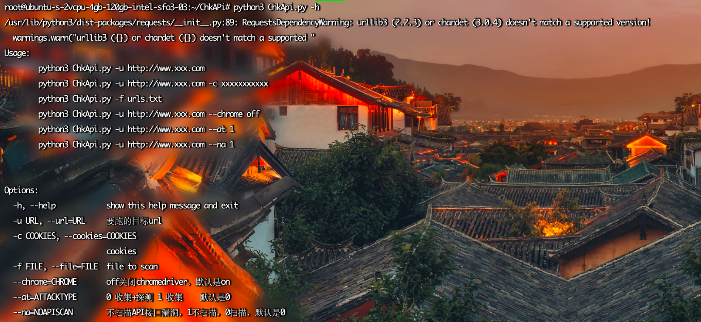

## 0x03 使用方法 

| 语法                                                    | 功能                                       |
| :------------------------------------------------------ | :----------------------------------------- |
| python3 ChkApi.py -u http://www.aaa.com                 | 对单一url进行扫描                          |
| python3 ChkApi.py -u http://www.aaa.com -c "xxxxxxxxxx" | 携带cookies对单一url进行扫描               |
| python3 ChkApi.py -f url.txt                            | 对文件里的网站进行扫描                     |
| python3 ChkApi.py -u http://www.aaa.com --chrome off    | off关闭chromedriver，默认是on              |
| python3 ChkApi.py -u http://www.aaa.com --at 1          | 0 收集+探测、1 收集， 默认是0              |
| python3 ChkApi.py -u http://www.aaa.com --na 1          | 不扫描API接口漏洞，1不扫描，0扫描，默认是0 |

## 0x04 API安全实践架构方案

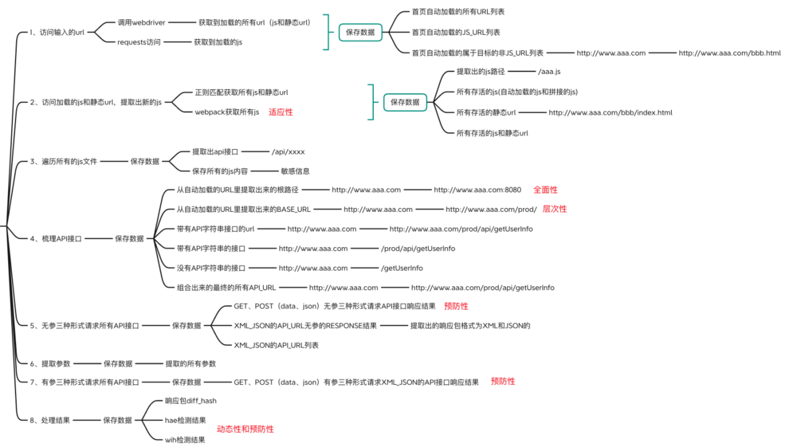

##  0x05 API安全实践架构方案

**1、访问目标地址提取出自动加载的JS地址和静态地址**

获取JS地址有如下三种方式——加载当前域JS、加载CDN JS、加载其它域JS。

(1) 加载的当前域JS：访问的URL地址为https://xxx.domain.com，该URL加载了当前域的JS（https://xxx.domain.com/js/yyy.js）。

 

(2) 加载的CDN JS：访问的URL地址为https://xxx.domain.com，该URL加载了CDN的JS（https://xxxcdn.com/js/yyy.js）。

 

(3) 加载的其他域JS：访问的URL地址为https://xxx.domain.com，该URL加载了其它域的JS（https://xxx.domain.com:8080/js/yyy.js）。

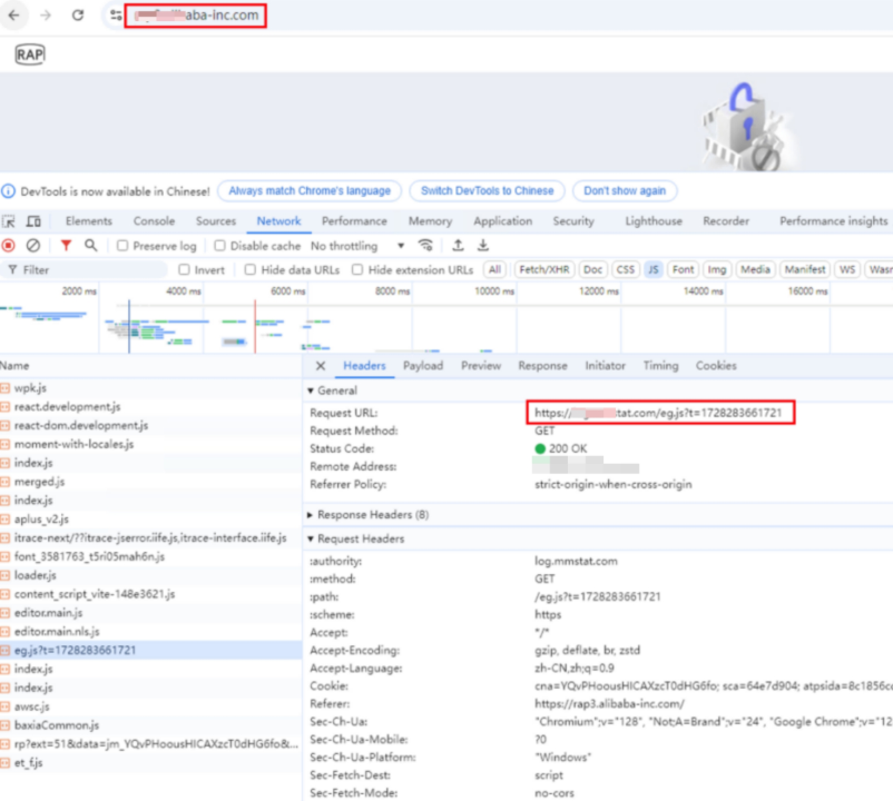 

(4) 静态地址：访问的URL地址为https://xxx.domain.com，该URL地址加载了静态地址（https://xxx.domain.com/path/zzz.html）。提取静态地址的目的是在于全面获取目标网站的所有业务功能页面，确保不遗漏任何相关接口。

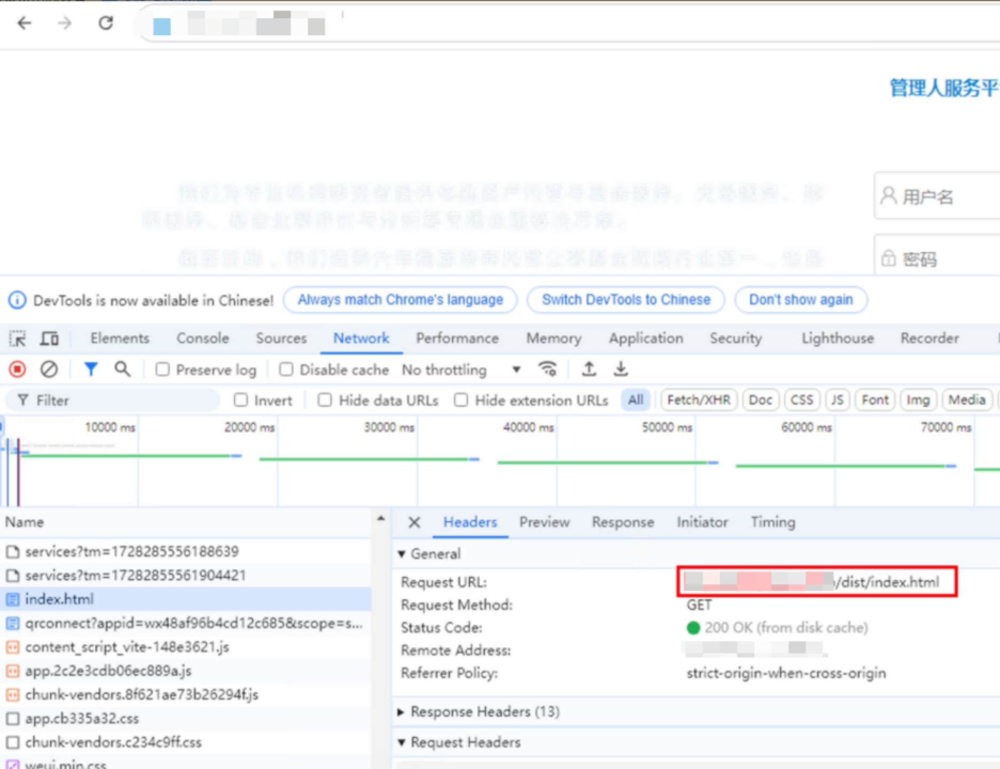 

**2、提取网页未自动加载的JS地址**

请求上述步骤获取到的JS地址，通过正则匹配语法，提取出在网页源码里的JS地址。

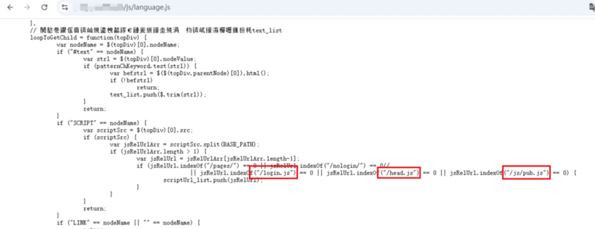 

请求上述步骤获取到的静态地址，通过正则匹配语法，提取出在网页源码里的JS地址。

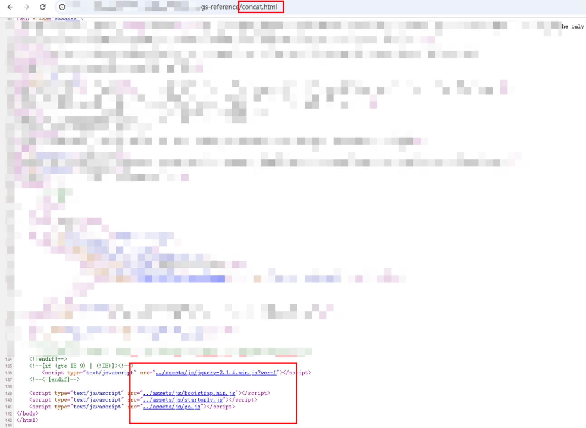 

**3、从webpack（JavaScript 应用程序的模块打包工具）提取JS地址**

下图就是通过webpack打包JS地址的效果，实际上其中一个JS地址为/static/js/chunk-60893c6c.6867bfa5.js，因此需要通过正则语法精确提取出红框里的内容，并拼接成完整的JS地址。

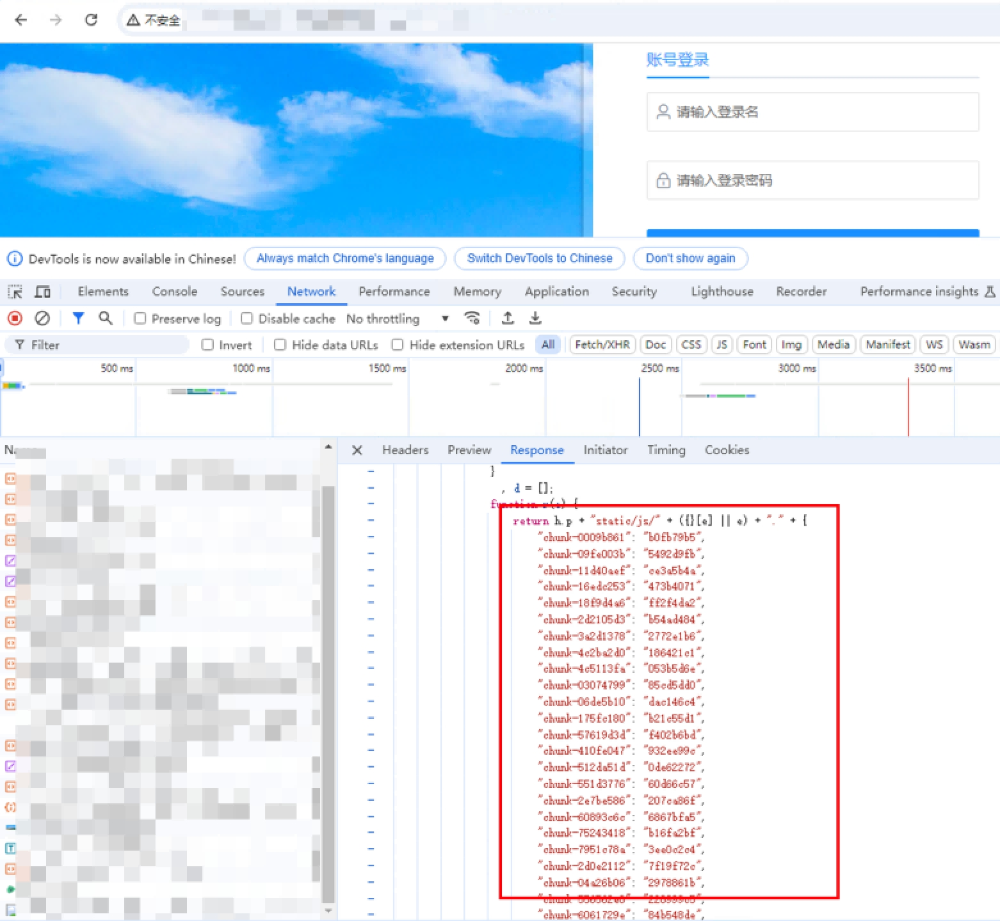 

 

**4、Base URL发现**

Base URL 可以理解为每个微服务的服务名称。在许多微服务架构的系统中，每个微服务都包含着大量的 API 接口，因此寻找 API 接口的关键之一是确定正确的微服务名称。

微服务名称通常体现在 URL 地址的不同路径中，这个路径我称之为 Base URL。

寻找Base URL有两种方式——自动加载的URL地址里就有Base URL、自动加载的API接口里提取出Base URL。

(1) 自动加载的URL地址里就有Base URL：访问的URL地址为https://xxx.domain.com，该URL地址自动加载了地址（https://xxx.domain.com/authControl），那么可以认为authControl就是Base URL。

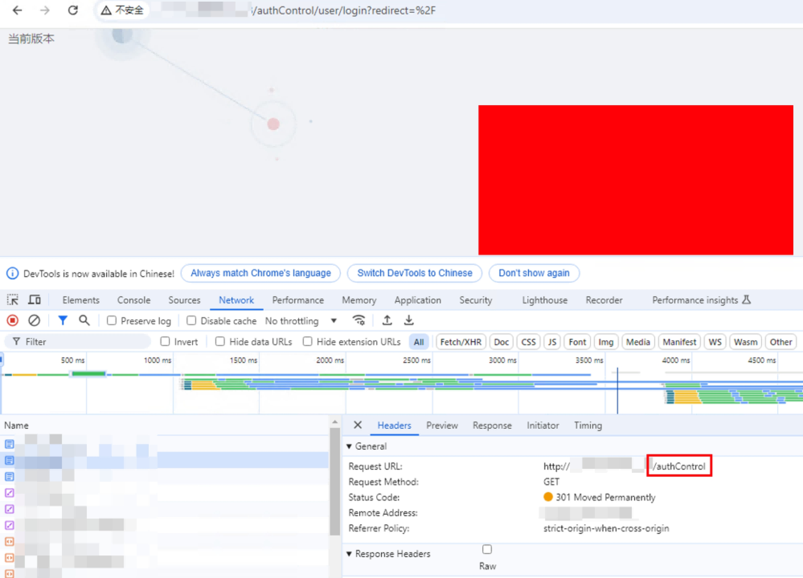 

(2) 自动加载的API接口里提取出Base URL：访问的URL地址为https://xxx.domain.com，该URL地址自动加载了某API接口（https://xxx.domain.com/ophApi/checkCode/getCheckCode），在后续的API接口提取步骤中如果发现某API接口是/checkCode/getCheckCode，那么就会将ophApi当作Base URL。

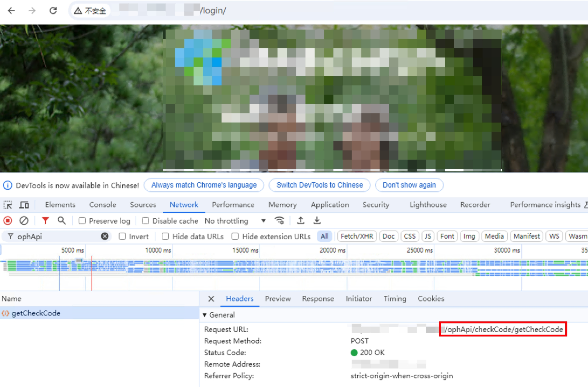 

**5、API接口的提取和Fuzz**

(1) 请求上述所有的 JS 地址，并通过全面的正则表达式规则提取出 API 接口。例如，下图所示的 API 接口“/service/getFile?filePath=”。

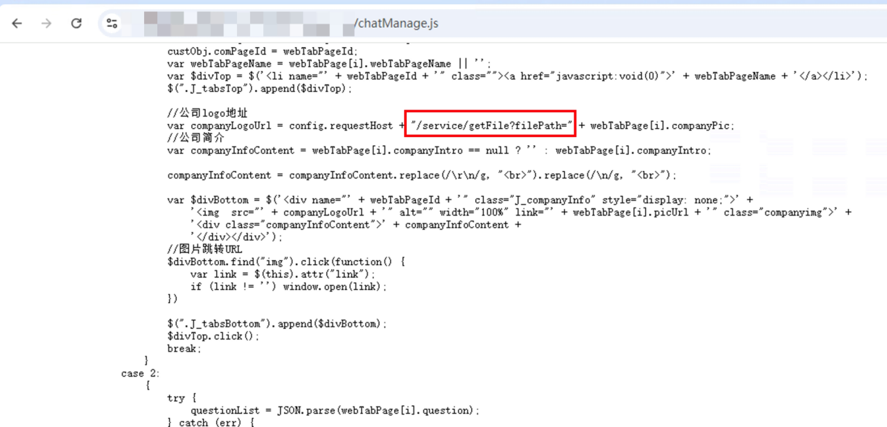 

(2) 使用常见的API接口字典进行Fuzz测试，内置了一些常见的API接口字符串，以补充和完善API接口的提取过程。

 

**6、Swagger各版本解析**

支持解析各种版本的 Swagger 规范，能够精确提取所有 API 接口、请求方式、参数名称和参数类型。

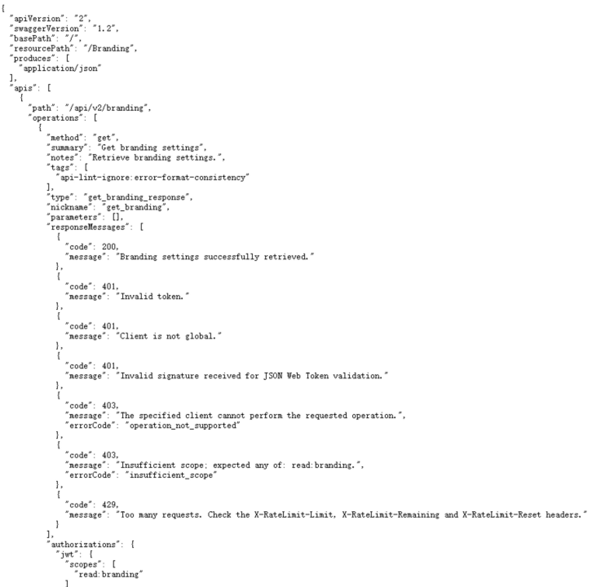 

 

**7、过滤危险接口**

有些 API 接口可能涉及删除或取消等业务操作，因此需要对这些接口进行过滤。内置了以下关键字来过滤危险接口。

 

 

**8、无参三种形式请求所有API接口**

上述步骤已提取出所有API接口，并通过 GET、POST DATA 和 POST JSON 三种请求方式逐一请求这些接口，保存每个接口的响应包内容。

 

**9、智能提取参数**

从无参三种请求形式保存的 API 接口响应包中提取参数，具体包括以下三种情况：

(1) 提取响应包内容中的 key 作为参数：

如果响应包包含字段名，这些字段名将被提取为参数。例如，提取出 id 和 branchCollegeName。{"code":0,"msg":"success","data":[{"id":"xxxxxx","branchCollegeName":"xxxxxxxx"}]}

(2) 提取 key 为 param 或 parameter时所对应的 value 作为参数：例如，提取出 imageId。

{"code":200,"data":{"param":"imageId"}}

(3) 提取响应包内容报错时，错误信息中提示缺失的内容作为参数：例如，提取出 types 或 accountId。

{"code":1,"msg":"Required List parameter 'types' is not present","data":null}

{"code":500,"msg":"accountId不能为空"}

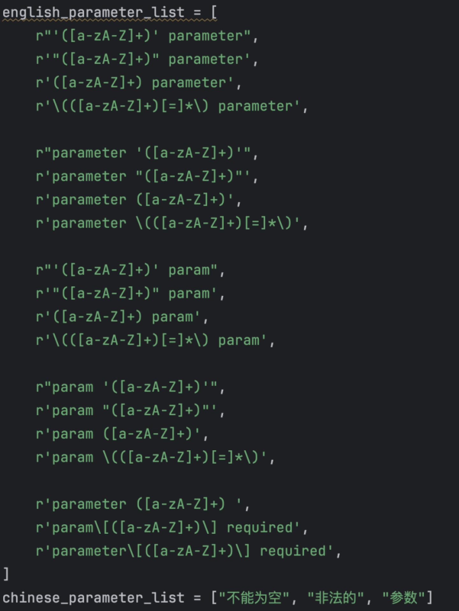 

如下是提取出的参数名列表

 

**10、有参三种形式请求所有API接口**

从上述步骤中整理出所有参数名称后，再次通过 GET、POST DATA 和 POST JSON 三种请求方式，携带这些参数逐一请求所有 API 接口，并保存每个接口的响应包内容。

 

 

 

**11、Bypass测试API接口**

对于返回状态码 301、302、401、404 等或者响应包为空的 API 接口，内置了十多种绕过方法（Bypass 技术）进行再次测试。

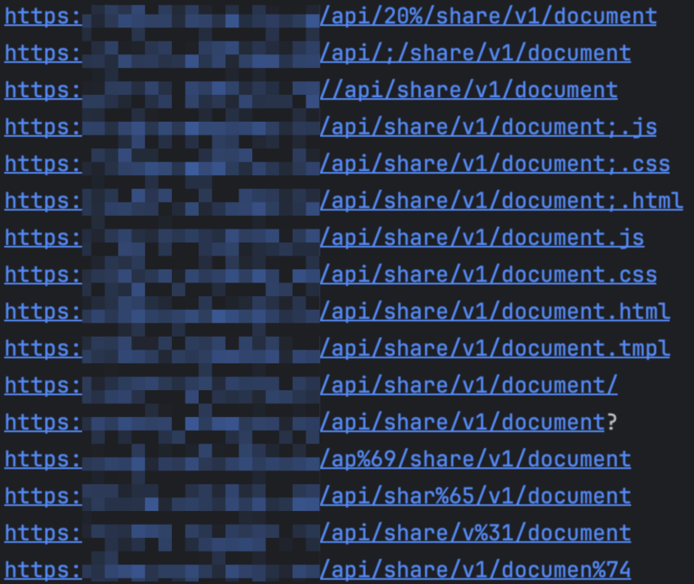 

### 0x06 数据整理

在整个方案架构设计中，设置了三种数据存储方式，分别为文本文件（txt）、电子表格（Excel）和数据库（MySQL）。此项目为了易用，移除了Mysql存储。

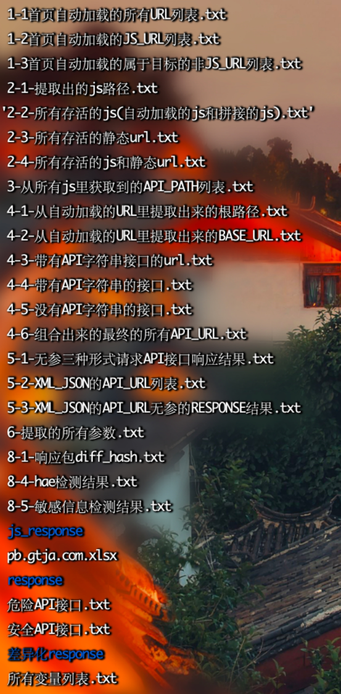 

 

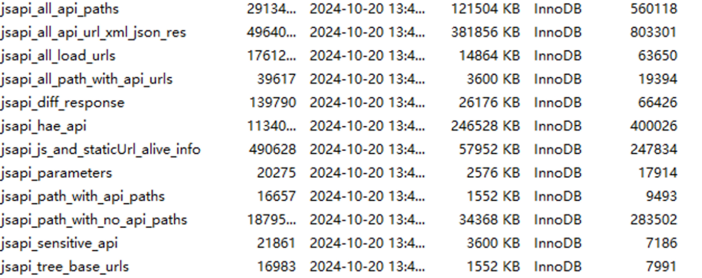 

下图展示了数据库中存储的“自动加载的URL”表。其中，url 字段表示被检测的 URL 地址，load_url 字段表示自动加载的 URL 地址，load_url_type 字段表示自动加载 URL 地址的类型。例如，js 表示该 URL 地址是 JS 文件，而 no_js 则表示静态地址或非 JS 类型的 API 接口等。referer 字段则说明自动加载的 URL 地址来源于哪个 URL。

 

下图展示了数据库中存储的“存活的 JS 和静态 URL”表。其中，js_static_url 字段表示 JS 地址或静态 URL，url_type 字段表示其类型。例如，js_url 表示该 URL 地址为 JS 文件，static_url 表示静态地址。status_code 字段表示响应的状态码，res_length 字段表示响应包内容的长度。

 

下图展示了数据库中存储的“JS地址里提取出来的所有api接口”表。其中，api_path 字段表示提取出来的API接口。

 

下图展示了数据库中存储的“Tree URL和Base URL”表。其中，tree_url字段表示被检测的URL地址加载了其它的URL，例如前后端分离的架构情况。Base URL在上述解释过，可以理解为微服务的接口地址。

 

下图展示了数据库中存储的“参数”表。其中，parameter字段表示提取出来的参数名。

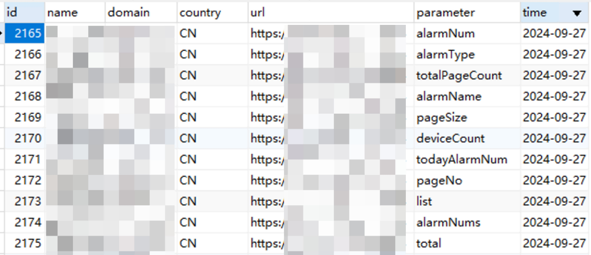 

下图展示了数据库中存储的“无参和有参三种请求方式结果”表。其中，api_url 字段表示 API 接口地址，method 字段表示请求方式，包括 GET、POST DATA 和 POST JSON 三种方式。parameter 字段表示请求 API 接口时携带的参数。res_type 字段表示响应包的返回格式，code 字段表示响应状态码，length 字段表示响应包内容的长度。

这张表需要特别关注，因为在后续的运营过程中，通过分析这些数据可以发现大量 Web 漏洞。举例说明：

寻找RCE漏洞：在api_url和parameter字段模糊匹配ping、cmd、command等关键词。

寻找URL跳转或者SSRF漏洞：模糊匹配url、ip等关键词。

寻找任意文件上传或者读取漏洞：模糊匹配upload、download、read、file等关键词。

寻找未授权访问漏洞：模糊匹配get、config等关键词。

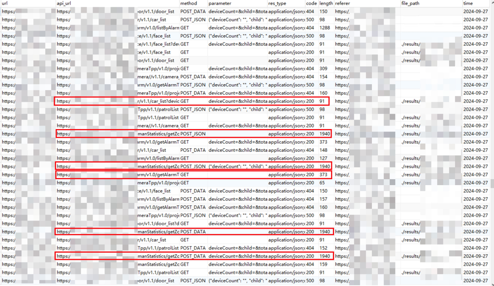 

下图展示了数据库中存储的“响应包差异化”表。其中，content_hash 字段表示响应包内容的哈希值，num 字段表示该哈希值出现的次数，length 字段表示对应响应包内容的长度，file_path 字段表示响应包保存的文件路径。

添加响应包差异化功能的原因在于，当测试 API 接口时未携带凭证，许多返回结果会是相同的提示缺少凭证的内容。通过此方法，可以快速过滤掉大量重复的响应包，从而降低运营成本。

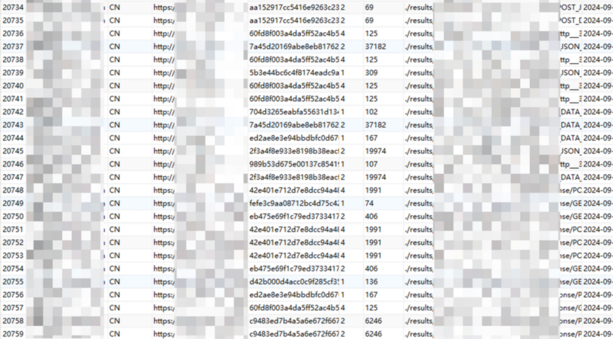 

下图展示了数据库中存储的“敏感信息泄漏”表，可以看到其中包含泄漏的敏感信息，如 JDBC 连接语句、账号密码、私钥、凭证，以及各种云平台的 AKSK 等。

 

## 0x07 待更新

Swagger和Bypass正在完善中，后续会更新上去，敬请期待。

## 0x08 反馈

ChkApi 是一个免费且开源的项目，我们欢迎任何人为其开发和进步贡献力量。

* 在使用过程中出现任何问题，可以通过 issues 来反馈。
* Bug 的修复可以直接提交 Pull Request 到 dev 分支。
* 如果是增加新的功能特性，请先创建一个 issue 并做简单描述以及大致的实现方法，提议被采纳后，就可以创建一个实现新特性的 Pull Request。
* 欢迎对说明文档做出改善，帮助更多的人使用 ChkApi。
* 贡献代码请提交 PR 至 dev 分支，master 分支仅用于发布稳定可用版本。

*提醒：和项目相关的问题最好在 issues 中反馈，这样方便其他有类似问题的人可以快速查找解决方法，并且也避免了我们重复回答一些问题。*

## Stargazers over time

[](https://starchart.cc/0x727/ShuiZe_0x727)

